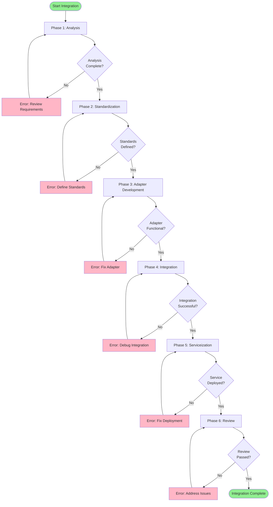
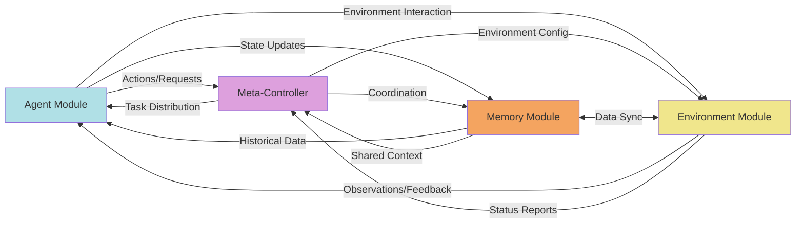
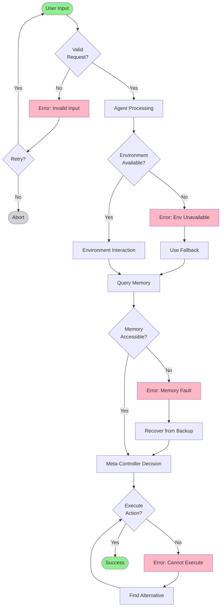
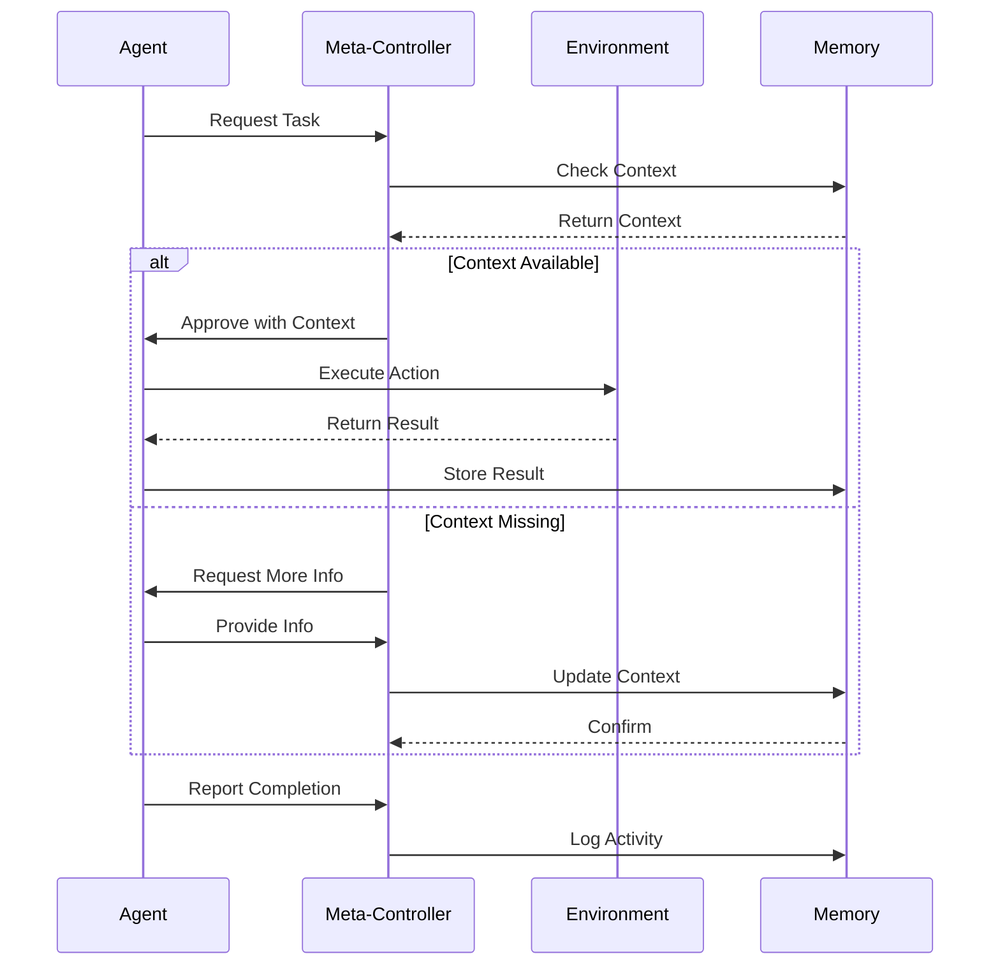

# Integration Workflow and Data Flow

This document illustrates the phased integration workflow and data flow between system modules.

## Integration Workflow

## Data Flow Between Modules

## Decision Flow with Error Handling

## Module Communication Protocol

