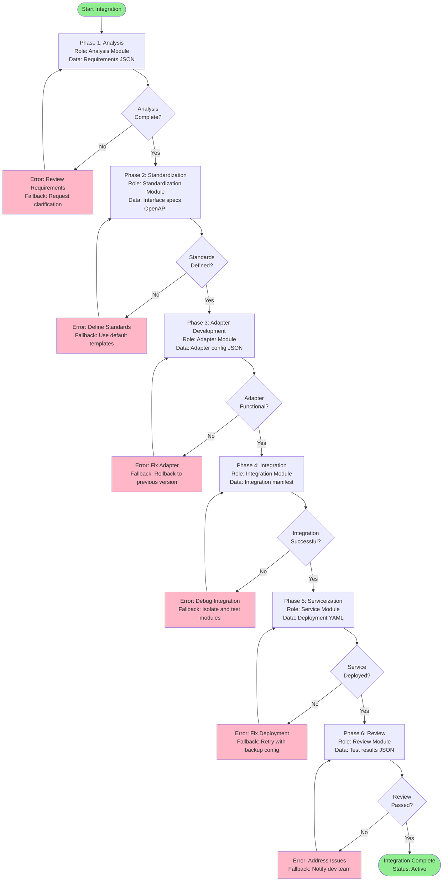
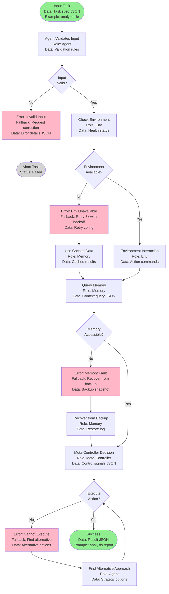
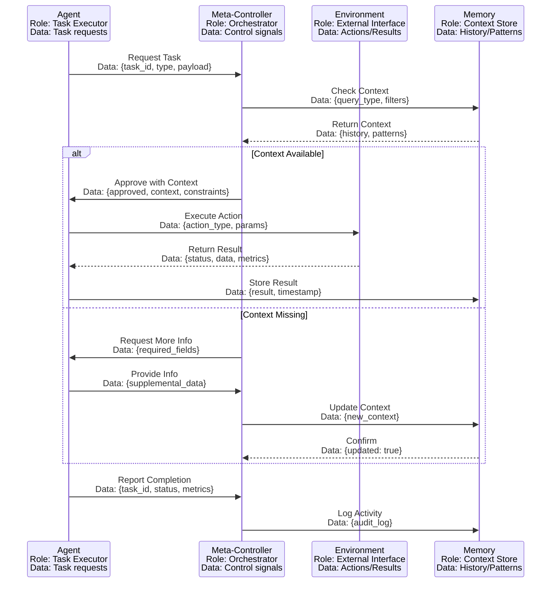

# Integration Workflow and Data Flow

This document illustrates the phased integration workflow and data flow between system modules, including module roles, data exchanged, error handling, and usage scenarios.

---

## Integration Workflow

### Module Roles:
- **Analysis Module**: Reviews requirements and validates integration feasibility
- **Standardization Module**: Defines interface contracts and data formats
- **Adapter Module**: Translates between different system interfaces
- **Integration Module**: Coordinates module connections and communication
- **Service Module**: Deploys and exposes integrated functionality
- **Review Module**: Validates integration quality and performance

### Data Exchanged:
- Requirements documents (JSON/YAML)
- Interface specifications (OpenAPI/gRPC)
- Adapter configurations (JSON)
- Integration status reports (JSON)
- Service deployment manifests (YAML)
- Test and validation results (JSON)

### Usage Scenario:
*Example: Integrating a new AI agent into the EFCA-v2 ecosystem*
1. Analysis: Parse agent capabilities → output: `{agent_type: "reasoning", capabilities: ["planning", "reflection"]}`
2. Standardization: Define EFCA adapter interface → output: `adapter_spec.yaml`
3. Adapter Development: Implement translation layer → output: `agent_adapter.py`
4. Integration: Connect to Meta-Controller → output: `integration_manifest.json`
5. Serviceization: Deploy as microservice → output: `service_endpoint: "agent.efca.local:8080"`
6. Review: Run validation tests → output: `{success: true, latency_ms: 45}`

---

## Data Flow Between Modules

### Module Roles:
- **Agent**: Task executor with specific capabilities (planning, reasoning, action)
- **Environment (Env)**: External interaction interface (API calls, file I/O, tool execution)
- **Meta-Controller**: High-level decision maker and orchestrator
- **Memory**: Persistent storage for context, history, and learned patterns

### Data Exchanged:
- **Input → Agent**: Task specification `{task_id, goal, constraints}`
- **Agent → Env**: Action commands `{action_type, parameters, expected_output}`
- **Env → Agent**: Observation results `{status, data, error_code}`
- **Agent ↔ Memory**: Context queries/updates `{query, context, timestamp}`
- **Meta-Controller → All**: Control signals `{priority, resource_limits, timeout}`

### Error/Fallback Paths:
- **Invalid Input** → Validation error → Request correction
- **Environment Unavailable** → Retry with exponential backoff → Use cached data
- **Memory Fault** → Recover from backup → Rebuild from logs
- **Execution Failure** → Find alternative approach → Escalate to Meta-Controller

### Usage Scenario:
*Example: Agent processes a file analysis task*
1. Input: `{task: "analyze_code", file: "main.py"}`
2. Agent validation: Check file exists → Yes
3. Environment check: File system accessible → Yes
4. Memory query: Retrieve previous analysis patterns
5. Agent executes: Parse AST, detect patterns
6. Environment interaction: Read file content
7. Meta-Controller: Approve action within resource limits
8. Success: Return analysis report

---

## Decision Flow with Error Handling

### Module Roles:
- **Decision Engine**: Evaluates conditions and selects execution paths
- **Error Handler**: Captures, logs, and routes errors to appropriate handlers
- **Recovery Manager**: Implements fallback strategies and retry logic

### Data Exchanged:
- Decision criteria `{conditions, weights, thresholds}`
- Error reports `{error_code, stack_trace, context}`
- Recovery actions `{strategy, parameters, success_probability}`
- Audit logs `{timestamp, action, outcome, metrics}`

### Usage Scenario:
*Example: Handling a failed API call with retry logic*
1. Decision: Attempt API call
2. Error: Connection timeout after 5s
3. Handler: Log error, classify as transient
4. Recovery: Retry with exponential backoff (2s, 4s, 8s)
5. Success on retry 2: Return data
6. Audit: Log `{attempt: 2, latency_ms: 4200, status: success}`

---

## Module Communication Protocol

### Module Roles:
- **Agent (A)**: Autonomous task executor
- **Meta-Controller (M)**: System orchestrator and resource manager
- **Environment (E)**: External interface for actions
- **Memory (Mem)**: Persistent context and history store

### Data Exchanged:
- **Request Task**: `{task_id, type, priority, payload}`
- **Context**: `{history, learned_patterns, user_preferences}`
- **Approval**: `{approved: bool, constraints, timeout}`
- **Action**: `{type, target, parameters}`
- **Result**: `{status, data, metrics, errors}`
- **Completion Report**: `{task_id, outcome, duration, resources_used}`
- **Activity Log**: `{timestamp, actor, action, outcome}`

### Error Handling:
- **Context Unavailable** → Request more info → Update context
- **Action Failure** → Retry with modified parameters → Escalate if persistent
- **Memory Error** → Use default context → Queue for later update

### Usage Scenario:
*Example: Agent completes a data processing task*
1. Agent → Meta-Controller: `{task: "process_dataset", dataset_id: "DS123"}`
2. Meta-Controller → Memory: Check if DS123 was processed before
3. Memory → Meta-Controller: `{last_processed: "2025-10-15", schema: {...}}`
4. Meta-Controller → Agent: `{approved: true, use_cached_schema: true}`
5. Agent → Environment: Execute processing with cached schema
6. Environment → Agent: `{status: "success", rows_processed: 10000}`
7. Agent → Memory: Store result and update timestamp
8. Agent → Meta-Controller: `{task_id: "T456", status: "complete", duration_ms: 3500}`
9. Meta-Controller → Memory: Log activity for audit trail

---

## Summary

This expanded flowchart provides:
1. **Module Roles**: Clear identification of each component's responsibility
2. **Data Specifications**: Detailed formats for all exchanged information
3. **Error/Fallback Paths**: Comprehensive error handling and recovery strategies
4. **Usage Scenarios**: Practical examples demonstrating real-world application

These enhancements ensure that developers can understand not just the "what" but also the "how" and "why" of system integration.
